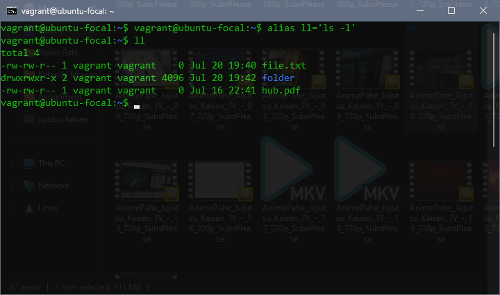

Hidden Gems: 10 Linux Commands You Probably Never Use (But Should)

# 🔍 Hidden Gems: 10 Linux Commands You Probably Never Use (But Should)

---

## 1. `alias`

**Use:** Create shortcuts for long or frequently used commands.

**Example:**

alias ll='ls -l'

2. unalias
You can remove or temporarily disable an alias using the unalias command.

unalias alias_name
❗️To Remove All Aliases:

unalias -a
⚠️ This removes all defined aliases in the current shell session.

Important Notes:

Aliases you define this way are temporary — they last only for your current shell session.
To make an alias permanent, you must add it to your shell’s config file:
Bash: ~/.bashrc or ~/.bash_profile
Zsh: ~/.zshrc
Example for permanent alias:

echo "alias ll='ls -lah'" >> ~/.bashrc
source ~/.bashrc
3. sort
Use: Sorts lines in a file alphabetically or numerically.
Example:

sort names.txt
This sorts the lines in names.txt alphabetically (A–Z).

🔁 Common Options

-r → Reverse sort (Z–A)
-n → Numerical sort
-k → Sort by a specific column
-t → Specify a delimiter (e.g., comma for CSV)
Example

sort -r name.txt
In this example, it sorts state.txt in reverse order.

4. stat
Use: Shows detailed information about a file (size, time modified, permissions, etc.).
Example:

stat file.txt
Shows when the file was last modified and its permissions.

5. uniq
Use: Removes duplicate lines from a sorted file.
Example:

sort file.txt | uniq
Sorts and then removes repeated lines.

Before (California is Duplicated)

After
6. tac
Use: Displays the contents of a file in reverse (last line first).
Example:

tac file.txt
Opposite of cat.

7. htop
Use: Interactive view of system processes, memory, and CPU usage (like top, but better).
Example:

htop
Use arrows and function keys to manage processes.

8. nl – Number lines in a file (more control than cat -n)
nl filename.txt
More formatting control than cat -n.

9. shuf – Shuffle lines randomly
shuf filename.txt
Randomizes the order of lines. Great for sampling data or creating test cases.

10. history
Use: Lists previously executed commands.
Example:

history
Useful to find and reuse past commands.

